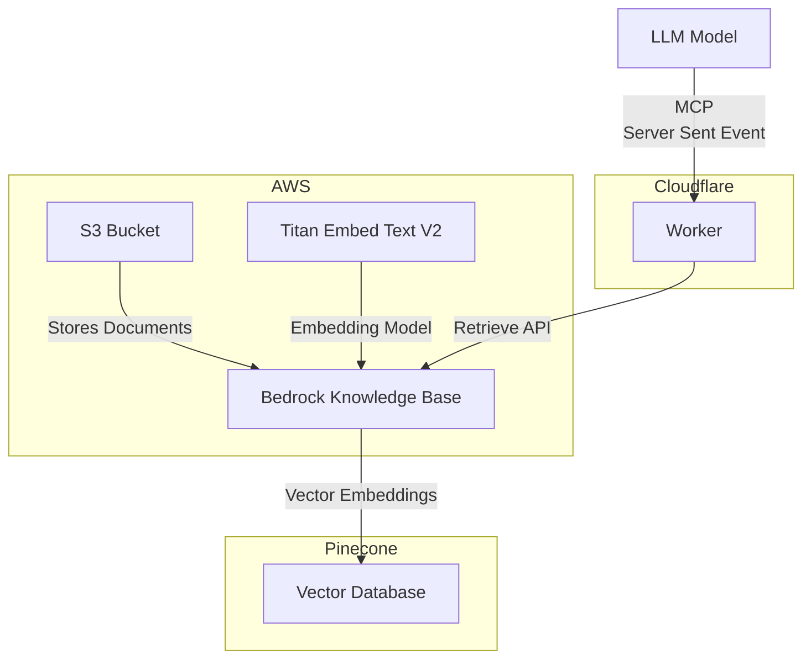

# AWS Knowledge Base MCP Server

## Usage

<table><tr><td>Claude Desktop</td><td>GitHub Copilot</td></tr><tr><td>

```json
{
  "mcpServers": {
    "knowledge-base": {
      "command": "npx",
      "args": [
        "mcp-remote",
        "https://aws-knowledge-base-mcp-server.daohoangson.workers.dev/sse"
      ]
    }
  }
}
```

</td><td>

```json
{
  "servers": {
    "aws-knowledge-base": {
      "type": "sse",
      "url": "https://aws-knowledge-base-mcp-server.daohoangson.workers.dev/sse"
    }
  }
}
```

</tr><tr><td>


</td><td>


</td></tr></table>

A Model Context Protocol (MCP) server implementation that enables AI assistants to search through Knowledge Base using AWS Bedrock and Cloudflare Workers. This project consists of two main components:

## Architecture

1. **Infrastructure** (`/cdk`): Sets up the resources including:

   - AWS Bedrock Knowledge Base for document embeddings
   - Pinecone for efficient document search
   - AWS S3 bucket for storing documentation files
   - AWS IAM user and policies for API access

2. **Cloudflare MCP Server** (`/cloudflare-mcp-server`): Implements the MCP server that:
   - Provides a `search_knowledge_base` tool for AI assistants
   - Integrates with AWS Bedrock for document retrieval
   - Runs on Cloudflare Workers



## Infrastructure

### Environment Variables

- `CDK_APP_ID` - Unique identifier for the CDK stack
- `PINECONE_API_KEY` - API key for Pinecone vector store

### Setup

```bash
cd cdk

# Install dependencies
npm install

# Set required environment variables
export CDK_APP_ID="your-app-id"
export PINECONE_API_KEY="your-pinecone-api-key"

# Deploy the stack
npx cdk deploy
```

## Cloudflare MCP Server

The MCP server provides a `search_knowledge_base` tool that can be used by AI assistants to search through indexed documents. The tool accepts a query string and returns relevant documentation.

### Environment Variables

- `AWS_ACCESS_KEY_ID` - AWS access key for Bedrock API
- `AWS_SECRET_ACCESS_KEY` - AWS secret key for Bedrock API
- `AWS_REGION` - AWS region (e.g., "us-east-1")
- `KNOWLEDGE_BASE_ID` - Bedrock Knowledge Base ID

### Setup

```bash
cd cloudflare-mcp-server

# Install dependencies
npm install

# Configure Wrangler
# Update wrangler.jsonc with your AWS credentials and Knowledge Base ID

# Deploy to Cloudflare
npm run deploy
```

## Cost Estimation

Assumptions:

- `us-east-1` region
- Total 2,000 documents
- Each document is ~5KB / ~1,250 tokens
- Re-index everything 30 times per month (real implementation will do it incrementally)
- Usage 3,000 requests per month
- Each request takes 5ms CPU time / 200ms wall time
- Each query is ~100 tokens
- Each request returns 10 documents

| Service     | SKU                         | Listing Price         | Monthly Count | Monthly Cost (USD) |
| ----------- | --------------------------- | --------------------- | ------------- | ------------------ |
| AWS Bedrock | Titan Embeddings (Indexing) | $0.00002 / 1K tokens  | 75,000K       | $1.5               |
|             | Titan Embeddings (Queries)  | $0.00002 / 1K tokens  | 300K          | $0.006             |
| AWS S3      | Standard Storage            | $0.023 / GB-month     | 0.01 GB       | $0.00023           |
|             | LIST Requests               | $0.005 / 1K requests  | 6K            | $0.03              |
|             | GET Requests                | $0.0004 / 1K requests | 60K           | $0.024             |
| CloudFlare  | Standard                    | $5 / month            | 1             | $5                 |
|             | Requests                    | $0.30 / million       | 0.003         | $0.0009            |
|             | CPU time                    | $0.00002 / CPU-second | 15            | $0.0003            |
| Pinecone    | Standard                    | $25 / month           | 1             | $25                |
|             | Vector Storage              | $0.33 / GB-month      | 0.008 GB      | $0.003             |
|             | Vector Inserts (Writes)     | $4 / million writes   | 0.06M         | $0.24              |
|             | Vector Queries (Reads)      | $16 / million reads   | 0.03M         | $0.48              |

- https://aws.amazon.com/bedrock/pricing/
- https://aws.amazon.com/s3/pricing/
- CloudFlare Standard plan includes [10M requests and 3K CPU-seconds](https://developers.cloudflare.com/workers/platform/pricing/).
- Pinecone Standard plan includes [$15/mo usage credits](https://www.pinecone.io/pricing/). Alternatives:
  - Aurora PostgreSQL Serverless for $180/mo with 1 writer, 1 reader, 2 NAT gateways, etc. (see [branch `aurora`](https://github.com/daohoangson/aws-knowledge-base-mcp-server/tree/aurora#cost-estimation))
  - Amazon OpenSearch Serverless for $350/mo minimum because it needs at least 1 indexing OCU and 1 searching OCU at [$0.24 / OCU-hour](https://aws.amazon.com/opensearch-service/pricing/)
