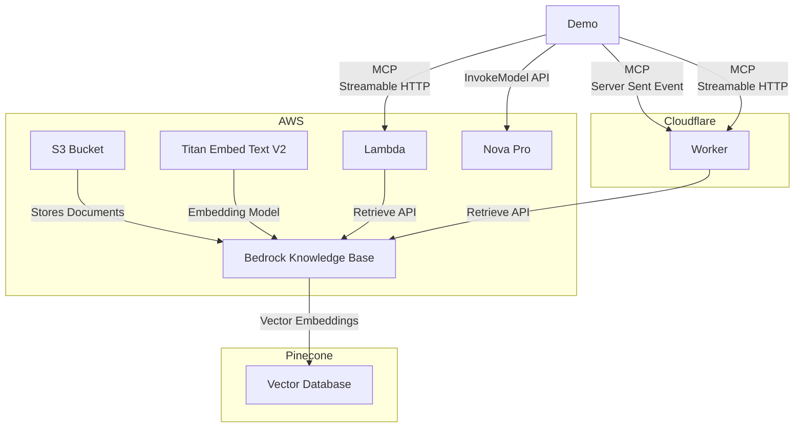

# AWS Knowledge Base MCP Server

## Usage

<table><tr><td>Claude Desktop</td><td>GitHub Copilot</td></tr><tr><td>

```json
{
  "mcpServers": {
    "knowledge-base": {
      "command": "npx",
      "args": [
        "mcp-remote",
        "https://aws-knowledge-base-mcp-server.daohoangson.workers.dev/sse"
      ]
    }
  }
}
```

</td><td>

```json
{
  "servers": {
    "aws-knowledge-base": {
      "type": "sse",
      "url": "https://aws-knowledge-base-mcp-server.daohoangson.workers.dev/sse"
    }
  }
}
```

</tr><tr><td>


</td><td>


</td></tr></table>

A Model Context Protocol (MCP) server implementation that enables AI assistants to search through Knowledge Base using AWS Bedrock and Cloudflare Workers. This project consists of three main components:

## Architecture

1. **Infrastructure** (`/cdk`): Sets up the resources including:

   - AWS Bedrock Knowledge Base for document embeddings
   - Pinecone for efficient document search
   - AWS S3 bucket for storing documentation files
   - AWS Lambda function for MCP server with streamable HTTP transport
   - AWS IAM user and policies for API access

2. **MCP Server** (`/cloudflare-mcp-server`): Implements the MCP server that:

   - Provides a `search_knowledge_base` tool for AI assistants
   - Integrates with AWS Bedrock for document retrieval
   - Supports both SSE (deprecated) and streamable HTTP transports
   - Runs on Cloudflare Workers with Node.js compatibility

3. **MCP Client** (`/ai-sdk-mcp-client`): A demo client that:
   - Uses [AI SDK by Vercel](https://sdk.vercel.ai) with Nova Pro model
   - Acts as a MCP client, supporting both SSE and streamable HTTP transports
   - Streams text responses with tool calls



## Infrastructure

### Setup

```bash
cd cdk

npm install

# Unique identifier for the CDK stack
export CDK_APP_ID="DocsMcpServer"

# Pinecone credentials to manage vector databases
export PINECONE_API_KEY="pcsk_foo"

# Deploy the stack
npx cdk deploy
```

### Example output

```
DocsMcpServer.AwsAccessKeyId = AKI123
DocsMcpServer.AwsRegion = us-east-1
DocsMcpServer.AwsSecretAccessKey = 4cQ456
DocsMcpServer.DataSourceId = OD6LTXXUNH
DocsMcpServer.DocsBucketName = docsmcpserver-docsbucketa5ce02e3-gg8g3crhlo1j
DocsMcpServer.KnowledgeBaseId = GZUYX1EGMF
DocsMcpServer.McpServerUrl = https://vc7ejtu4kk3ayeiqofkmxxzada0uwpzr.lambda-url.us-east-1.on.aws/
```

## Documentation Updates

The `/docs` directory contains scripts to update the knowledge base with the latest documentation:

```bash
cd docs

# Set environment variables from the CDK output
export DATA_SOURCE_ID="OD6LTXXUNH"
export DOCS_BUCKET_NAME="docsmcpserver-docsbucketa5ce02e3-gg8g3crhlo1j"
export KNOWLEDGE_BASE_ID="GZUYX1EGMF"

# Run the update script
./update.sh
```

This will:

1. Download the latest documentation from CloudFlare and MCP websites
2. Upload the files to S3
3. Start a new ingestion job to update the knowledge base

## MCP Server

The MCP server provides a `search_knowledge_base` tool that can be used by AI assistants to search through indexed documents. The tool accepts a query string and returns relevant documentation.

Create `.dev.vars` with the following variables from the CDK output:

```
AWS_ACCESS_KEY_ID=AKI123
AWS_REGION=us-east-1
AWS_SECRET_ACCESS_KEY=4cQ456
KNOWLEDGE_BASE_ID=GZUYX1EGMF
```

### Setup

```bash
cd cloudflare-mcp-server

npm install

npm run cf-typegen

# run locally
npm run dev

# or deploy to Cloudflare
npm run deploy
```

## MCP Client

The client demonstrates how to connect to the MCP server and use its tools with support for both SSE and streamable HTTP transports.

```bash
cd ai-sdk-mcp-client

npm install

# Set environment variables from the CDK output
export AWS_ACCESS_KEY_ID="AKI123"
export AWS_REGION="us-east-1"
export AWS_SECRET_ACCESS_KEY="4cQ456"

# Test connection to CloudFlare with SSE transport
npm start -- https://aws-knowledge-base-mcp-server.daohoangson.workers.dev/sse

# Test connection to CloudFlare with streamable HTTP transport
npm start -- https://aws-knowledge-base-mcp-server.daohoangson.workers.dev/mcp

# Test connection to Lambda
npm start -- https://vc7ejtu4kk3ayeiqofkmxxzada0uwpzr.lambda-url.us-east-1.on.aws/mcp
```

## Cost Estimation

Assumptions:

- `us-east-1` region
- Total 2,000 documents
- Each document is ~5KB / ~1,250 tokens
- Re-index everything 30 times per month (real implementation will do it incrementally)
- Usage 3,000 requests per month
- Each request takes 5ms CPU time / 200ms wall time
- Each query is ~100 tokens
- Each request returns 10 documents

| Service     | SKU                         | Listing Price         | Monthly Count | Monthly Cost (USD) |
| ----------- | --------------------------- | --------------------- | ------------- | ------------------ |
| AWS Bedrock | Titan Embeddings (Indexing) | $0.00002 / 1K tokens  | 75,000K       | $1.5               |
|             | Titan Embeddings (Queries)  | $0.00002 / 1K tokens  | 300K          | $0.006             |
| AWS Lambda  | Requests                    | $0.2 / 1M requests    | 0.003M        | $0.0006            |
|             | ARM64 Duration              | $0.0000133334 / GB-s  | 75 GB-s       | $0.001             |
|             | Data Transfer OUT           | $0.09 / GB            | 0.15 GB       | $0.0135            |
| AWS S3      | Standard Storage            | $0.023 / GB-month     | 0.01 GB       | $0.00023           |
|             | LIST Requests               | $0.005 / 1K requests  | 6K            | $0.03              |
|             | GET Requests                | $0.0004 / 1K requests | 60K           | $0.024             |
| CloudFlare  | Standard                    | $5 / month            | 1             | $5                 |
|             | Requests                    | $0.30 / million       | 0.003         | $0.0009            |
|             | CPU time                    | $0.00002 / CPU-second | 15            | $0.0003            |
| Pinecone    | Standard                    | $25 / month           | 1             | $25                |
|             | Vector Storage              | $0.33 / GB-month      | 0.008 GB      | $0.003             |
|             | Vector Inserts (Writes)     | $4 / million writes   | 0.06M         | $0.24              |
|             | Vector Queries (Reads)      | $16 / million reads   | 0.03M         | $0.48              |

- https://aws.amazon.com/bedrock/pricing/
- https://aws.amazon.com/s3/pricing/
- https://aws.amazon.com/lambda/pricing/
- CloudFlare Standard plan includes [10M requests and 3K CPU-seconds](https://developers.cloudflare.com/workers/platform/pricing/).
- Pinecone Standard plan includes [$15/mo usage credits](https://www.pinecone.io/pricing/). Alternatives:
  - Aurora PostgreSQL Serverless for $180/mo with 1 writer, 1 reader, 2 NAT gateways, etc. (see [branch `aurora`](https://github.com/daohoangson/aws-knowledge-base-mcp-server/tree/aurora#cost-estimation))
  - Amazon OpenSearch Serverless for $350/mo minimum because it needs at least 1 indexing OCU and 1 searching OCU at [$0.24 / OCU-hour](https://aws.amazon.com/opensearch-service/pricing/)
