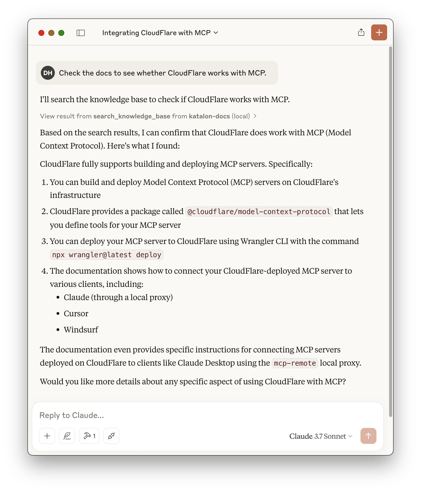
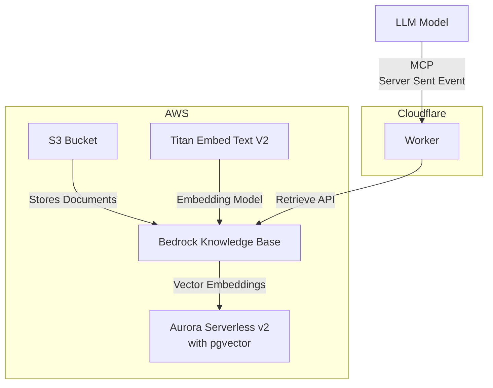

# AWS Knowledge Base MCP Server

```json
{
  "mcpServers": {
    "knowledge-base": {
      "command": "npx",
      "args": [
        "mcp-remote",
        "https://aws-knowledge-base-mcp-server.daohoangson.workers.dev/sse"
      ]
    }
  }
}
```



A Model Context Protocol (MCP) server implementation that enables AI assistants to search through Knowledge Base using AWS Bedrock and Cloudflare Workers. This project consists of two main components:

## Architecture

1. **Infrastructure** (`/cdk`): Sets up the resources including:

   - AWS Bedrock Knowledge Base for document embeddings
   - Aurora Serverless v2 with pgvector for efficient document search
   - AWS S3 bucket for storing documentation files
   - AWS IAM user and policies for API access

2. **Cloudflare MCP Server** (`/cloudflare-mcp-server`): Implements the MCP server that:
   - Provides a `search_knowledge_base` tool for AI assistants
   - Integrates with AWS Bedrock for document retrieval
   - Runs on Cloudflare Workers



## Infrastructure

### Environment Variables

- `CDK_APP_ID` - Unique identifier for the CDK stack

### Setup

```bash
cd cdk

# Install dependencies
npm install

# Set required environment variables
export CDK_APP_ID="your-app-id"

# Deploy the stack
npx cdk deploy
```

## Cloudflare MCP Server

The MCP server provides a `search_knowledge_base` tool that can be used by AI assistants to search through indexed documents. The tool accepts a query string and returns relevant documentation.

## Environment Variables

- `AWS_ACCESS_KEY_ID` - AWS access key for Bedrock API
- `AWS_SECRET_ACCESS_KEY` - AWS secret key for Bedrock API
- `AWS_REGION` - AWS region (e.g., "us-east-1")
- `KNOWLEDGE_BASE_ID` - Bedrock Knowledge Base ID

### Setup

```bash
cd cloudflare-mcp-server

# Install dependencies
npm install

# Configure Wrangler
# Update wrangler.jsonc with your AWS credentials and Knowledge Base ID

# Deploy to Cloudflare
npm run deploy
```

## Cost Estimation

Assumptions:

- `us-east-1` region
- Total 2,000 documents
- Each document is ~5KB / ~1,250 tokens
- Re-index everything 30 times per month (real implementation will do it incrementally)
- Usage 3,000 requests per month
- Each request takes 5ms CPU time / 200ms wall time
- Each query is ~100 tokens
- Each request returns 10 documents

| Provider   | Service                     | Listing Price         | Unit       | Monthly Count | Monthly Cost (USD) |
| ---------- | --------------------------- | --------------------- | ---------- | ------------- | ------------------ |
| AWS        | S3 Standard Storage         | $0.023 / GB-month     | GB-month   | 0.01 GB       | $0.00023           |
| AWS        | S3 LIST Requests            | $0.005 / 1K requests  | Requests   | 6K            | $0.03              |
| AWS        | S3 GET Requests             | $0.0004 / 1K requests | Requests   | 60K           | $0.024             |
| AWS        | Titan Embeddings (Indexing) | $0.00002 / 1K tokens  | Tokens     | 75,000K       | $1.5               |
| AWS        | Titan Embeddings (Queries)  | $0.00002 / 1K tokens  | Tokens     | 300K          | $0.006             |
| CloudFlare | Standard                    | $5 / month            | Month      | 1             | $5                 |
| CloudFlare | Requests                    | $0.30 / million       | Requests   | 0.003         | $0.0009            |
| CloudFlare | CPU time                    | $0.00002 / CPU-second | CPU-second | 15            | $0.0003            |

- CloudFlare Standard plan includes [10M requests and 3K CPU-seconds](https://developers.cloudflare.com/workers/platform/pricing/).
- https://aws.amazon.com/bedrock/pricing/
- https://aws.amazon.com/s3/pricing/
