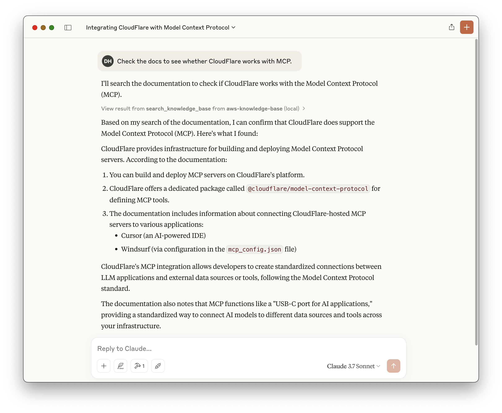
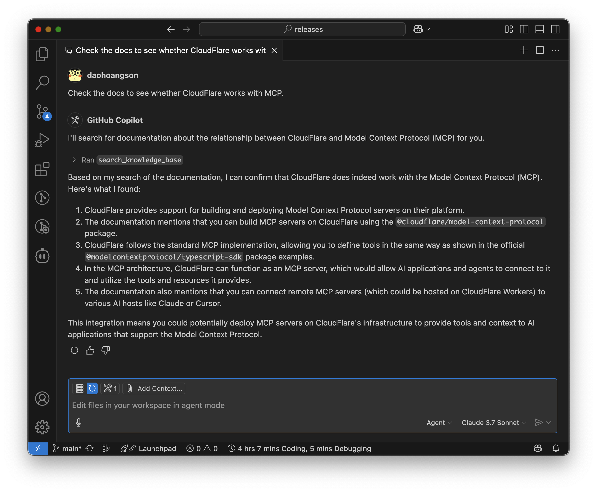
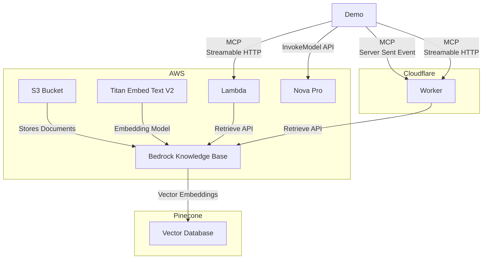

[](https://mseep.ai/app/daohoangson-aws-knowledge-base-mcp-server)

# AWS Knowledge Base MCP Server

## Usage

<table><tr><td>Claude Desktop</td><td>GitHub Copilot</td></tr><tr><td>

```json
{
  "mcpServers": {
    "knowledge-base": {
      "command": "npx",
      "args": [
        "mcp-remote",
        "https://aws-knowledge-base-mcp-server.daohoangson.workers.dev/sse"
      ]
    }
  }
}
```

</td><td>

```json
{
  "servers": {
    "aws-knowledge-base": {
      "type": "sse",
      "url": "https://aws-knowledge-base-mcp-server.daohoangson.workers.dev/sse"
    }
  }
}
```

</tr><tr><td>



</td><td>



</td></tr></table>

A Model Context Protocol (MCP) server implementation that enables AI assistants to search through Knowledge Base using AWS Bedrock and Cloudflare Workers. This project consists of three main components:

## Architecture

1. **Infrastructure** (`/cdk`): Sets up the resources including:

   - AWS Bedrock Knowledge Base for document embeddings
   - Pinecone for efficient document search
   - AWS S3 bucket for storing documentation files
   - AWS Lambda function for MCP server with streamable HTTP transport
   - AWS IAM user and policies for API access

2. **MCP Server** (`/cloudflare-mcp-server`): Implements the MCP server that:

   - Provides a `search_knowledge_base` tool for AI assistants
   - Integrates with AWS Bedrock for document retrieval
   - Supports both SSE (deprecated) and streamable HTTP transports
   - Runs on Cloudflare Workers with Node.js compatibility

3. **MCP Client** (`/ai-sdk-mcp-client`): A demo client that:
   - Uses [AI SDK by Vercel](https://sdk.vercel.ai) with Nova Pro model
   - Acts as a MCP client, supporting both SSE and streamable HTTP transports
   - Streams text responses with tool calls



## Infrastructure

### Setup

```bash
cd cdk

npm install

# Unique identifier for the CDK stack
export CDK_APP_ID="DocsMcpServer"

# Pinecone credentials to manage vector databases
export PINECONE_API_KEY="pcsk_foo"

# Deploy the stack
npx cdk deploy
```

### Example output

```
DocsMcpServer.AwsAccessKeyId = AKI123
DocsMcpServer.AwsRegion = us-east-1
DocsMcpServer.AwsSecretAccessKey = 4cQ456
DocsMcpServer.DataSourceId = OD6LTXXUNH
DocsMcpServer.DocsBucketName = docsmcpserver-docsbucketa5ce02e3-gg8g3crhlo1j
DocsMcpServer.KnowledgeBaseId = GZUYX1EGMF
DocsMcpServer.McpServerUrl = https://vc7ejtu4kk3ayeiqofkmxxzada0uwpzr.lambda-url.us-east-1.on.aws/
```

## Documentation Updates

The `/docs` directory contains scripts to update the knowledge base with the latest documentation:

```bash
cd docs

# Set environment variables from the CDK output
export DATA_SOURCE_ID="OD6LTXXUNH"
export DOCS_BUCKET_NAME="docsmcpserver-docsbucketa5ce02e3-gg8g3crhlo1j"
export KNOWLEDGE_BASE_ID="GZUYX1EGMF"

# Run the update script
./update.sh
```

This will:

1. Download the latest documentation from CloudFlare and MCP websites
2. Upload the files to S3
3. Start a new ingestion job to update the knowledge base

## MCP Server

The MCP server provides a `search_knowledge_base` tool that can be used by AI assistants to search through indexed documents. The tool accepts a query string and returns relevant documentation.

Create `.dev.vars` with the following variables from the CDK output:

```
AWS_ACCESS_KEY_ID=AKI123
AWS_REGION=us-east-1
AWS_SECRET_ACCESS_KEY=4cQ456
KNOWLEDGE_BASE_ID=GZUYX1EGMF
```

### Setup

```bash
cd cloudflare-mcp-server

npm install

npm run cf-typegen

# run locally
npm run dev

# or deploy to Cloudflare
npm run deploy
```

## MCP Client

The client demonstrates how to connect to the MCP server and use its tools with support for both SSE and streamable HTTP transports.

### Setup

```bash
cd ai-sdk-mcp-client

npm install

# Set environment variables from the CDK output
export AWS_ACCESS_KEY_ID="AKI123"
export AWS_REGION="us-east-1"
export AWS_SECRET_ACCESS_KEY="4cQ456"

# Test connection to CloudFlare with SSE transport
npm start -- https://aws-knowledge-base-mcp-server.daohoangson.workers.dev/sse

# Test connection to CloudFlare with streamable HTTP transport
npm start -- https://aws-knowledge-base-mcp-server.daohoangson.workers.dev/mcp

# Test connection to Lambda
npm start -- https://vc7ejtu4kk3ayeiqofkmxxzada0uwpzr.lambda-url.us-east-1.on.aws/mcp
```

### Example output

```
Created MCP client

{ tools: [ 'search_knowledge_base' ] }

<thinking> To determine if CloudFlare works with the Model Context Protocol (MCP), I need to search the knowledge base for relevant documentation. </thinking>

Tool call: search_knowledge_base {
  "query": "Does CloudFlare work with Model Context Protocol (MCP)?"
}
```

<details><summary>Tool result</summary>

````json
{
  "content": [
    {
      "type": "text",
      "text": "includes(\"special_feature\")) {     this.server.tool(\"specialTool\", \"Special feature\", {}, async () => {       // This tool only appears for users with the special_feature permission     });   } } ```  Benefits:  - Authorization check at the tool level ensures proper access control - Allows you to define permission checks once and reuse them across tools - Provides clear feedback to users when permission is denied - Can choose to only present tools that the agent is able to call  ## Next steps  - [Learn how to use the Workers OAuth Provider Library](https://github.com/cloudflare/workers-oauth-provider) - Learn how to use a third-party OAuth provider, using the [GitHub](/agents/guides/remote-mcp-server/#add-authentication) example MCP server.  ---  # Model Context Protocol (MCP)  URL: https://developers.cloudflare.com/agents/model-context-protocol/  You can build and deploy [Model Context Protocol (MCP)](https://modelcontextprotocol.io/) servers on Cloudflare.  ## What is the Model Context Protocol (MCP)?  [Model Context Protocol (MCP)](https://modelcontextprotocol.io) is an open standard that connects AI systems with external applications. Think of MCP like a USB-C port for AI applications."
    },
    {
      "type": "text",
      "text": "can call.  When you build MCP Servers with the `@cloudflare/model-context-protocol` package, you can define tools the [same way as shown in the `@modelcontextprotocol/typescript-sdk` package's examples](https://github.com/modelcontextprotocol/typescript-sdk?tab=readme-ov-file#tools)."
    },
    {
      "type": "text",
      "text": "See our [list of example servers](https://modelcontextprotocol.io/examples), or [get started building your own server](https://modelcontextprotocol.io/quickstart/server).   # Introduction Source: https://modelcontextprotocol.io/introduction  Get started with the Model Context Protocol (MCP)  <Note>C# SDK released! Check out [what else is new.](/development/updates)</Note>  MCP is an open protocol that standardizes how applications provide context to LLMs. Think of MCP like a USB-C port for AI applications. Just as USB-C provides a standardized way to connect your devices to various peripherals and accessories, MCP provides a standardized way to connect AI models to different data sources and tools.  ## Why MCP?  MCP helps you build agents and complex workflows on top of LLMs. LLMs frequently need to integrate with data and tools, and MCP provides:  * A growing list of pre-built integrations that your LLM can directly plug into * The flexibility to switch between LLM providers and vendors * Best practices for securing your data within your infrastructure  ### General architecture  At its core, MCP follows a client-server architecture where a host application can connect to multiple servers:  ```mermaid flowchart LR     subgraph \"Your Computer\"         Host[\"Host with MCP Client\\n(Claude, IDEs, Tools)\"]         S1[\"MCP Server A\"]         S2[\"MCP Server B"
    },
    {
      "type": "text",
      "text": "). - **Local MCP connections**: MCP clients connect to MCP servers on the same machine, using [stdio](https://spec.modelcontextprotocol.io/specification/draft/basic/transports/#stdio) as a local transport method.  ### Get Started  Go to the [Getting Started](/agents/guides/remote-mcp-server/) guide to learn how to build and deploy your first remote MCP server to Cloudflare.  ---  # McpAgent — API Reference  URL: https://developers.cloudflare.com/agents/model-context-protocol/mcp-agent-api/  import { Render, TypeScriptExample } from \"~/components\";  When you build MCP Servers on Cloudflare, you extend the [`McpAgent` class](https://github.com/cloudflare/agents/blob/5881c5d23a7f4580600029f69307cfc94743e6b8/packages/agents/src/mcp.ts), from the Agents SDK, like this:  <TypeScriptExample>  ```ts title=\"src/index.ts\" import { McpAgent } from \"agents/mcp\"; import { DurableMCP } from \"@cloudflare/model-context-protocol\";  export class MyMCP extends McpAgent { \tserver = new McpServer({ name: \"Demo\", version: \"1.0.0\" });  \tasync init() { \t\tthis.server.tool( \t\t\t\"add\", \t\t\t{ a: z.number(), b:"
    },
    {
      "type": "text",
      "text": "For instance, if the client doesn't have access to Claude models but has Gemini, it might map the sonnet hint to `gemini-1.5-pro` based on similar capabilities.  ## Error Handling  Clients **SHOULD** return errors for common failure cases:  Example error:  ```json {   \"jsonrpc\": \"2.0\",   \"id\": 1,   \"error\": {     \"code\": -1,     \"message\": \"User rejected sampling request\"   } } ```  ## Security Considerations  1. Clients **SHOULD** implement user approval controls 2. Both parties **SHOULD** validate message content 3. Clients **SHOULD** respect model preference hints 4. Clients **SHOULD** implement rate limiting 5. Both parties **MUST** handle sensitive data appropriately   # Specification Source: https://modelcontextprotocol.io/specification/2025-03-26/index    [Model Context Protocol](https://modelcontextprotocol.io) (MCP) is an open protocol that enables seamless integration between LLM applications and external data sources and tools. Whether you're building an AI-powered IDE, enhancing a chat interface, or creating custom AI workflows, MCP provides a standardized way to connect LLMs with the context they need."
    }
  ]
}
````

</details>

> Yes, CloudFlare supports the Model Context Protocol (MCP). You can build and deploy MCP servers on CloudFlare. The documentation indicates that CloudFlare provides packages and examples to help you get started with MCP servers.
>
> For more detailed information, you can refer to the [Model Context Protocol documentation on CloudFlare](https://developers.cloudflare.com/agents/model-context-protocol/).

## Cost Estimation

Assumptions:

- `us-east-1` region
- Total 2,000 documents
- Each document is ~5KB / ~1,250 tokens
- Re-index everything 30 times per month (real implementation will do it incrementally)
- Usage 3,000 requests per month
- Each request takes 5ms CPU time / 200ms wall time
- Each query is ~100 tokens
- Each request returns 10 documents

| Service     | SKU                         | Listing Price         | Monthly Count | Monthly Cost (USD) |
| ----------- | --------------------------- | --------------------- | ------------- | ------------------ |
| AWS Bedrock | Titan Embeddings (Indexing) | $0.00002 / 1K tokens  | 75,000K       | $1.5               |
|             | Titan Embeddings (Queries)  | $0.00002 / 1K tokens  | 300K          | $0.006             |
| AWS Lambda  | Requests                    | $0.2 / 1M requests    | 0.003M        | $0.0006            |
|             | ARM64 Duration              | $0.0000133334 / GB-s  | 75 GB-s       | $0.001             |
|             | Data Transfer OUT           | $0.09 / GB            | 0.15 GB       | $0.0135            |
| AWS S3      | Standard Storage            | $0.023 / GB-month     | 0.01 GB       | $0.00023           |
|             | LIST Requests               | $0.005 / 1K requests  | 6K            | $0.03              |
|             | GET Requests                | $0.0004 / 1K requests | 60K           | $0.024             |
| CloudFlare  | Standard                    | $5 / month            | 1             | $5                 |
|             | Requests                    | $0.30 / million       | 0.003         | $0.0009            |
|             | CPU time                    | $0.00002 / CPU-second | 15            | $0.0003            |
| Pinecone    | Standard                    | $25 / month           | 1             | $25                |
|             | Vector Storage              | $0.33 / GB-month      | 0.008 GB      | $0.003             |
|             | Vector Inserts (Writes)     | $4 / million writes   | 0.06M         | $0.24              |
|             | Vector Queries (Reads)      | $16 / million reads   | 0.03M         | $0.48              |

- https://aws.amazon.com/bedrock/pricing/
- https://aws.amazon.com/s3/pricing/
- https://aws.amazon.com/lambda/pricing/
- CloudFlare Standard plan includes [10M requests and 3K CPU-seconds](https://developers.cloudflare.com/workers/platform/pricing/).
- Pinecone Standard plan includes [$15/mo usage credits](https://www.pinecone.io/pricing/). Alternatives:
  - Aurora PostgreSQL Serverless for $180/mo with 1 writer, 1 reader, 2 NAT gateways, etc. (see [branch `aurora`](https://github.com/daohoangson/aws-knowledge-base-mcp-server/tree/aurora#cost-estimation))
  - Amazon OpenSearch Serverless for $350/mo minimum because it needs at least 1 indexing OCU and 1 searching OCU at [$0.24 / OCU-hour](https://aws.amazon.com/opensearch-service/pricing/)
